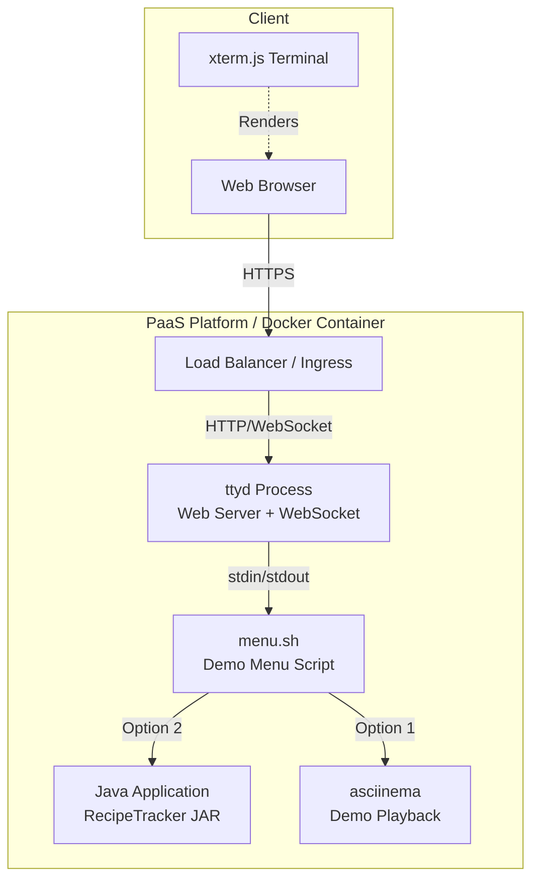

# Design Document: Web Terminal Deployment

## Overview

本设计文档描述了将 RecipeTracker 部署仓库的 Web 终端部署功能合并到主仓库的技术方案。通过集成 ttyd、asciinema 和 GitHub Actions 工作流，实现完整的 Web 终端部署能力。

## Architecture



### 部署架构

1. **Docker 容器**: 基于 eclipse-temurin:17-jdk-alpine 镜像
2. **ttyd**: 监听 8000 端口，提供 Web 终端服务
3. **menu.sh**: 入口脚本，提供演示菜单
4. **asciinema**: 播放预录制的演示
5. **Java JAR**: RecipeTracker 应用程序

## Components and Interfaces

### 1. Dockerfile (Enhanced)

更新现有 Dockerfile 以支持 Web 终端部署：

```dockerfile
FROM eclipse-temurin:17-jdk-alpine

# 安装依赖
RUN apk add --no-cache ttyd util-linux asciinema ncurses

WORKDIR /app

# 复制应用文件
COPY target/RecipeTracker-*.jar app.jar
COPY deploy/demo.cast demo.cast
COPY deploy/menu.sh menu.sh

RUN chmod +x /app/menu.sh

EXPOSE 8000

# 环境变量配置
ENV TERM=xterm-256color
ENV LANG=C.UTF-8
ENV LC_ALL=C.UTF-8

# 启动 ttyd
CMD ["sh", "-c", "ttyd -p 8000 -W -m 200 -t fontSize=14 /app/menu.sh"]
```

### 2. menu.sh (Demo Menu Script)

```bash
#!/bin/sh
# RecipeTracker 演示菜单

while true; do
    clear
    echo ""
    echo "欢迎进入 RecipeTracker 演示环境"
    echo "默认等待5秒自动进入演示模式，你可以随时Ctrl + C打断"
    echo ""
    echo "1.  观看演示"
    echo "2.  快速体验"
    echo "3.  退出"
    echo ""
    printf "请选择 [1-3]: "
    if read -t 5 choice; then
        :
    else
        echo ""
        choice=1
        sleep 1
    fi
    
    case $choice in
        1)
            clear
            echo ""
            sleep 1
            asciinema play /app/demo.cast
            echo ""
            echo ""
            echo "按回车键返回菜单..."
            read _
            ;;
        2)
            clear
            echo "启动 RecipeTracker 请稍后..."
            echo ""
            java -Djline.terminal=dumb -jar /app/app.jar
            echo ""
            echo "应用已退出，按回车键返回菜单..."
            read _
            ;;
        3)
            clear
            echo "感谢体验 RecipeTracker 再见！"
            exit 0
            ;;
        *)
            echo "无效选择，请输入 1-3..."
            sleep 1
            ;;
    esac
done
```

### 3. GitHub Actions Workflows

#### 3.1 Claude Code Review (.github/workflows/claude-code-review.yml)

自动对 PR 进行代码审查。

#### 3.2 Claude Interactive (.github/workflows/claude.yml)

通过 @claude 触发 AI 交互。

#### 3.3 Security Scan (.github/workflows/security-gitguardian.yml)

GitGuardian 密钥扫描。

## Data Models

### 文件结构

```
recipe-tracker/
├── .github/
│   └── workflows/
│       ├── claude-code-review.yml    # PR 代码审查
│       ├── claude.yml                 # Claude 交互
│       └── security-gitguardian.yml   # 安全扫描
├── deploy/
│   ├── demo.cast                      # asciinema 演示录制
│   └── menu.sh                        # 演示菜单脚本
├── Dockerfile                         # 更新的 Docker 配置
└── ... (existing files)
```

### 配置数据

| 配置项 | 值 | 说明 |
|--------|-----|------|
| ttyd 端口 | 8000 | Web 终端服务端口 |
| 最大连接数 | 200 | ttyd -m 参数 |
| 字体大小 | 14 | ttyd -t fontSize 参数 |
| 菜单超时 | 5秒 | 自动选择演示模式 |

## Correctness Properties

*A property is a characteristic or behavior that should hold true across all valid executions of a system-essentially, a formal statement about what the system should do. Properties serve as the bridge between human-readable specifications and machine-verifiable correctness guarantees.*

### Property 1: Menu displays all required options

*For any* execution of menu.sh, the output SHALL contain all three menu options: "观看演示", "快速体验", and "退出"

**Validates: Requirements 2.1**

### Property 2: Menu input validation

*For any* user input that is not "1", "2", or "3", the menu SHALL display an error message and return to the menu without crashing

**Validates: Requirements 2.1, 2.2, 2.3, 2.4**

### Property 3: Docker image contains required binaries

*For any* built Docker image, the image SHALL contain the binaries: ttyd, asciinema, and java

**Validates: Requirements 1.4**

## Error Handling

### Container Startup Errors

| 错误场景 | 处理方式 |
|----------|----------|
| ttyd 启动失败 | 容器退出，返回非零退出码 |
| JAR 文件缺失 | menu.sh 显示错误信息 |
| demo.cast 缺失 | asciinema 显示文件未找到错误 |

### Runtime Errors

| 错误场景 | 处理方式 |
|----------|----------|
| Java 应用崩溃 | 返回菜单，显示"应用已退出" |
| 无效菜单输入 | 显示错误提示，重新显示菜单 |
| WebSocket 断开 | 客户端自动重连 |

## Testing Strategy

### Unit Testing

使用 shell 脚本测试框架（如 bats）测试 menu.sh 的基本功能：

- 测试菜单输出包含所有选项
- 测试无效输入处理
- 测试退出功能

### Property-Based Testing

使用 bats (Bash Automated Testing System) 进行属性测试：

- 验证菜单脚本的输出格式
- 验证 Docker 镜像内容

### Integration Testing

- 构建 Docker 镜像并验证启动
- 验证 ttyd 端口可访问
- 验证 asciinema 播放功能

### GitHub Actions Testing

- 验证工作流配置语法正确
- 验证触发条件配置正确
