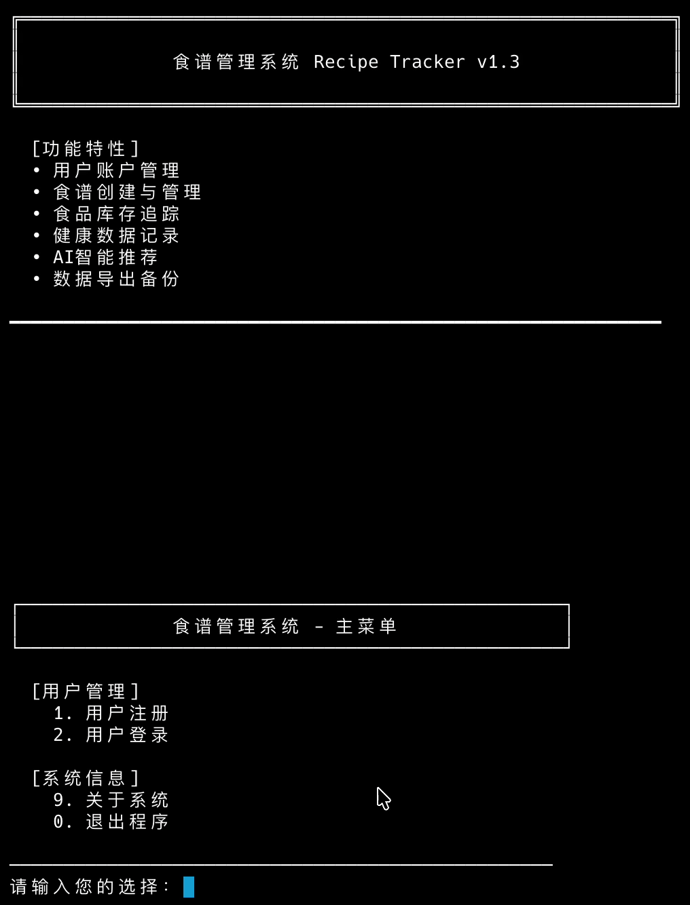
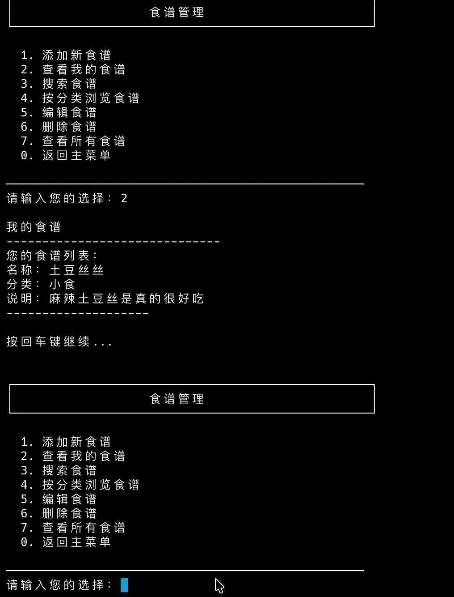
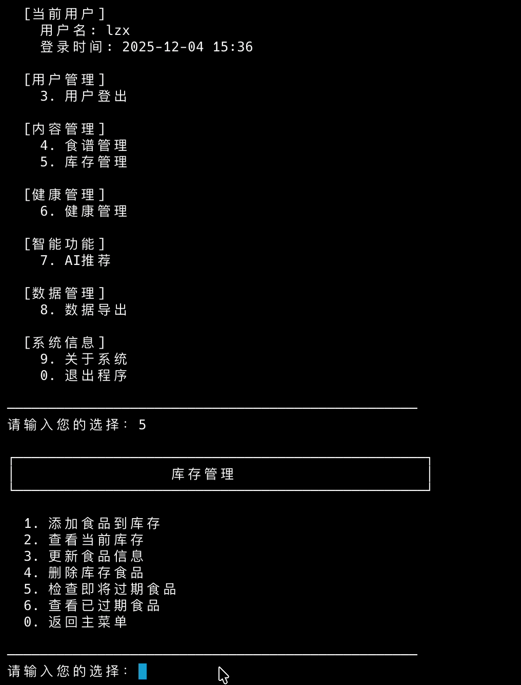

<div align="center">


## 基于Java 带有LLM API交互的食谱管理系统

[](https://www.java.com/)
[](https://maven.apache.org/)
[](https://www.mysql.com/)
[](LICENSE)

[界面展示](#界面展示) •
[快速开始](#云端开始) •
[本地部署](#本地部署) 

<a href="https://managing-tallie-copytek-1cbed079.koyeb.app/">
  
</a>

</div>

## 界面展示

<details open>
<summary><b>点击展开/收起 界面截图</b></summary>
<br>

| 登录/注册和主界面 | 食谱管理 |
|:---:|:---:|
|  |  |

| 食材库 | 健康数据追踪 |
|:---:|:---:|
|  |  |

</details>

## 云端开始

<div align="center">
  

[点我查看配套Dockerfile项目](https://github.com/ChaNg1o1/recipetracker-deploy)
</div>


[点我云端](https://managing-tallie-copytek-1cbed079.koyeb.app/)快速体验，也可以通过已配置好的 TiDB 云数据库来跳过本地环境配置直接体验。但云端无法显示导出功能的结果。

## 本地部署

#### 1. 克隆项目

```bash
git clone https://gitee.com/chang1o/recipe-tracker
cd RecipeTracker
```

#### 2. 配置数据库

<details>
<summary><b>方式一：TiDB 云数据库</b></summary>

编辑 `src/main/java/com/chang1o/util/DBUtil.java`：

```diff
- props.load(DBUtil.class.getClassLoader().getResourceAsStream("database.properties"));
+ props.load(DBUtil.class.getClassLoader().getResourceAsStream("clouddatabase.properties"));
```

> **备注**: TiDB 云数据库位于 AWS 日本区域，存在网络延迟

</details>

<details>
<summary><b>方式二：本地 MySQL 数据库</b></summary>

```bash
# 1. 确保 MySQL 服务已启动

# 2. 创建数据库表结构
mysql -u root -p < src/main/resources/schema.sql

# 3. 导入初始数据
mysql -u root -p < src/main/resources/init_data.sql

# 4. 修改配置文件 src/main/resources/database.properties
```

```properties
db.username=root
db.password=your_password
```

</details>

#### 3. 构建与运行

```bash
# 编译项目
mvn clean compile
```

| 运行方式 | 命令 | 适用场景 |
|:--------:|------|:--------:|
| Unix | `chmod +x run.sh && ./run.sh` | 开发调试 |
| Windows | `run.bat` | 开发调试 |
| Maven | `mvn exec:java -Dexec.mainClass="com.chang1o.recipe.Main"` | 开发调试 |
| JAR | `mvn clean package && java -jar target/RecipeTracker-1.0-SNAPSHOT.jar` | 生产部署 |
---

<div align="center">
Made with care by ChaNg1o and his AI ❤️ Friends
</div>
